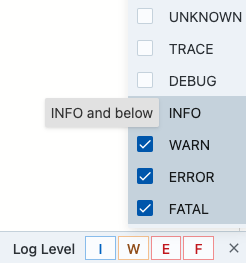

# Overview

The log viewer offers two ways to filter logs by their level. You can enable filtering
by entering the key containing the log level in the settings ({fas}`gear`) dialog.
The syntax for the key is the same as the format string [field name syntax](format-struct-logs-syntax).

* [Format string syntax](format-struct-logs-syntax)

## Severity-based filtering
You can filter for log events at or above a selected level by clicking the level's name. For
example, selecting INFO shows INFO, WARN, ERROR, and FATAL logs.

## Individual level filtering
You can select specific log levels to show or hide by checking or unchecking the checkbox next to
each level's name.

